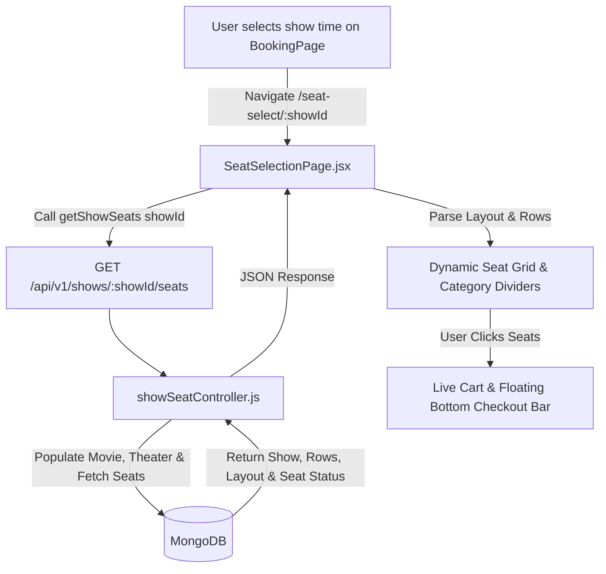

# 🎬 CineVerse Screen Seat Layout Integration Guide

This guide documents the integration of the **District / BookMyShow-style interactive screen seat layout** in the CineVerse web application, powered by the `getShowSeats` API endpoint.

---

## 📌 Architecture & Integration Overview



---

## 🔌 API Endpoint & Response Contract

### Endpoint
`GET /api/v1/shows/:showId/seats`

### Controller Implementation
- **File**: `server/controllers/showSeatController.js`
- **Function**: `exports.getShowSeats`

### JSON Response Contract
```json
{
  "success": true,
  "data": {
    "show": {
      "_id": "6abddb2b11b0b22d820e6ec4",
      "screenName": "Screen 1",
      "showDate": "2026-10-01T00:00:00.000Z",
      "startTime": "2026-10-01T09:30:00.000Z",
      "categoryPrice": [
        { "category": "REGULAR", "price": 200 },
        { "category": "PREMIUM", "price": 350 }
      ]
    },
    "movie": {
      "_id": "66f...",
      "title": "Pushpa 2: The Rule",
      "censorRating": "UA",
      "duration": 200,
      "genres": ["Action", "Crime", "Drama"]
    },
    "theater": {
      "_id": "66f...",
      "name": "PVR Inox GT Central"
    },
    "rows": [
      {
        "label": "O",
        "category": "regular",
        "price": 220,
        "layout": "SSSSSSSSSSS_XXXX_SSSSSSSS",
        "seats": [
          { "number": 1, "seatId": "O1", "status": "available", "rowPrice": 220 },
          { "number": 2, "seatId": "O2", "status": "booked", "rowPrice": 220 },
          { "number": 3, "seatId": "O3", "status": "locked", "rowPrice": 220 }
        ]
      }
    ]
  }
}
```

---

## 🎨 Frontend Component & Layout Architecture

### 1. Route Configuration (`App.jsx`)
Added route `/seat-select/:showId` pointing to `SeatSelectionPage`:

```jsx
import SeatSelectionPage from './pages/SeatSelectionPage';

<Route path="/seat-select/:showId" element={<SeatSelectionPage />} />
```

### 2. Service Layer (`movie.api.js`)
Invokes the backend API:

```javascript
import api from '../lib/api';

export const getShowSeats = (showId) => {
  return api.get(`shows/${showId}/seats`);
};
```

---

## ⚙️ Layout Engine Logic

### 1. Category Price Headers & Theater Layout Ordering
Rows are grouped by category (e.g. `PREMIUM : ₹350`, `REGULAR : ₹200`), rendering horizontal category divider lines:

```
───────── PREMIUM : ₹350 ───────── (Back of Theater - Top of UI)
Row F ... Row J

───────── REGULAR : ₹200 ───────── (Front of Theater - Bottom of UI)
Row A ... Row E

        =====================
           SCREEN THIS WAY
```

Category groups are sorted by price and tier rank descending (`(b.price - a.price) || (categoryRank(b.category) - categoryRank(a.category))`) to guarantee that **PREMIUM** seats appear at the **TOP** (Back of theater) and **REGULAR** seats appear at the **BOTTOM** (Front of theater, right above `SCREEN THIS WAY`).

### 2. Layout Pattern Parser (`row.layout`)
`row.layout` controls seat spacing and gaps:
- `'S'`: Renders a seat item from `row.seats`.
- `'_'` or `' '`: Renders a 20px aisle gap.
- `'X'`: Renders an empty or occupied placeholder slot.

### 3. Seat Status & Interactive States
- **Available**: White pill with subtle border (`#cbd5e1`). Hoverable and clickable.
- **Occupied (`booked` / `locked`)**: Light gray background (`#f1f5f9`), muted text with a subtle cross `×`. Disabled.
- **Selected**: Vibrant indigo/purple fill (`#6366f1`), white bold text, glow shadow.

### 4. Curved 3D Perspective Screen
Implements the signature District 3D curved screen bar at the bottom using CSS perspective transforms and radial gradients:

```css
height: 36px;
background: linear-gradient(180deg, rgba(129, 140, 248, 0.4) 0%, rgba(99, 102, 241, 0.05) 100%);
border-radius: 50% 50% 0 0 / 100% 100% 0 0;
border-top: 3px solid #818cf8;
transform: perspective(300px) rotateX(-20deg);
```

### 5. Sticky Floating Checkout Drawer
Appears smoothly at the bottom when seats are selected:
- Displays selected seat labels (e.g., `O1, O2`).
- Dynamically calculates total price (`₹440`).
- Provides a direct "Proceed to Pay" action button.

---

## 🚀 Verification

1. Start server & client:
   ```bash
   npm run dev
   ```
2. Navigate to movie details and click a show time (e.g. `09:30 AM`).
3. System routes to `/seat-select/<showId>`.
4. Layout renders dynamically with categories, rows, seats, screen indicator, and checkout drawer.
